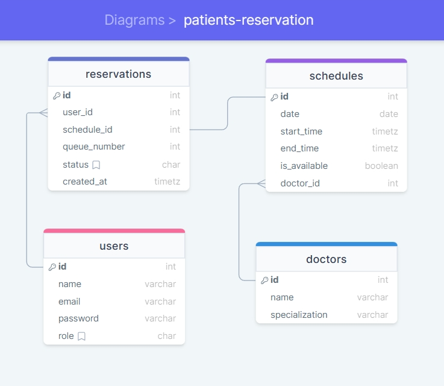

# patients-reservation

Part of initial recruitment test by Zi.Care, I was tasked to design schema and write the CRUD APIs for the topic patients reservation, where from a list of patients, each of them can book a reservation for a consultation and the reservation is based on the clinic slot/schedule availability, lastly the patient will get the queue number.

## Database Schema


Explanations:
1. For simplicity purposes, I only put the main information on both users table and doctors table (in real cases, they will be more informative)
2. There are two roles available for users table: `admin` and `patient`, where the default is `patient`
3. The schedules are set so that each entry can only be booked one at a time.
4. The `created_at` on reservations table's is currently not used in any logic in any endpoints but can be used for future updates where sorting is required.

## How to Set Up

To Start the patients-reservation APIs locally, follow these steps:

1. Clone this repository to your local machine:

```bash
git clone https://github.com/SherinOlivia/patients-reservation.git
```

2. Navigate into the project directory:

```bash
cd patients-reservation
```

3. Open it in VSCode or any other of your choice:

```bash
code .
```
4. Install The Dependencies:

```bash
pipenv install
```
or

```bash
pip install -r requirement.txt
```

5. Run the Server:

```bash
uvicorn main:app --reload
```

6. Test the APIs through Postman. by using any of these links:
**note:**Please inform me of any issues, because the `free instance will spin down with inactivity, which can delay requests by 50 seconds or more`

```bash
https://patients-reservation.onrender.com
```
or

```bash
http://localhost:8000/
```
or

7. Or access the documentation provided by fastapi: [here](https://patients-reservation.onrender.com/docs) or [here (local)](http://localhost:8000/docs) 

## Assumptions Made During Development

1. **Users:** 
- registration process gives the user the role `patient` by default.
- registering as `admin` can **only** be done by existing admins
2. **Doctors:** 
- Doctor registrations can **only** be done by `admin` and **only** for reservation purposes not for directly interacting with the `patient` (therefore no login function available for `doctors`)
- list of doctors can be accessed by patients.
3. **Schedules:** 
- each schedule **only** has one slot, hence the usage of `is_available` field.
- `admin` can create new schedules with new date using data of existing date.
- `admin` can manually update the availability of each schedule
4. **Reservations:** 
- resets **by date** instead of hourly
- **cannot** book reservations on schedules with **same date and time** even if by different doctors
- `admin` can fetch reservation list of every patients.
- `admin` manually updates the reservation status.
- status **cannot** be updated if they are `cancelled` or `completed`

## Personal Take

This mini project has been really challenging for me, especially as a first-timer in using fastapi framework. Fortunately for me, the information provided on the internet, whether through the [official documentation](https://fastapi.tiangolo.com/), questions someone else asked on Stack Overflow, private consultations with ChatGPT or anywhere else online is vast and informative.

Especially thanks to this question on Stack Overflow: [What are the best practices for structuring a FastAPI project?](https://stackoverflow.com/questions/64943693/what-are-the-best-practices-for-structuring-a-fastapi-project), I was able to start on a good footing ˙ᵕ˙

This project, although started as part of the recruitment test by Zi.Care, is a promising project that I would love to return to develop and polish further! ˙ᵕ˙

#### Contact Me

[SOChronicle@gmail.com](mailto:SOChronicle@gmail.com)

[SOlivia198@gmail.com](mailto:SOlivia198@gmail.com) 

[](https://discord.com/users/shxdxr#7539)[](https://instagram.com/shxdxr?igshid=MzRlODBiNWFlZA==)[](https://www.linkedin.com/in/sherin-olivia-07311127a/)
